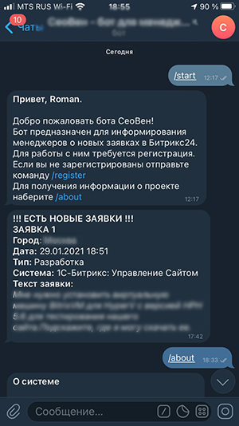

# telegrambot_bitrix24_requests
Данный бот позволяет менеджерам не профукать очередную новую заявку в системе <i>Битрикс24 - Заявки клиентов</i>. 
Он берет последние по дате 20 завок и сравнивает с теми же данными, но некоторое время назад. 
При обнаружении новой, необработанной заявки система формирует подробный отчет по этим заявкам и оповещает всех менеджеров, кто зарегистрирован в системе и кому предоставлен доступ. 

 
Разработчик системы 
Роман Сергеевич Гринько 
rsgrinko@gmail.com 
https://it-stories.ru 
 
P.S. Система была реализована "на коленке" за пару вечеров, поэтому в ней возможны недоработанные места.

